# Advanced RAG System

Upload documents and ask AI questions about them with source citations.

## 🏗️ Architecture

```mermaid
graph TB
    User[👤 User] --> WebUI[🌐 React Frontend]
    WebUI --> API[🔌 FastAPI Backend]
    API --> Processor[📝 Document Processor]
    API --> QueryEngine[🔍 Query Engine]
    
    Processor --> Embeddings[🧠 OpenAI Embeddings]
    Embeddings --> VectorDB[(🗄️ Qdrant Vector DB)]
    
    QueryEngine --> VectorDB
    QueryEngine --> LLM[🤖 GPT-4]
    
    API --> PostgreSQL[(💾 PostgreSQL)]
    API --> Redis[(⚡ Redis Cache)]
```



## 🚀 Quick Start

```bash
# Clone and setup
git clone <repository-url>
cd ai-rag-python
cp .env.example .env
# Edit .env with your OpenAI API key

# Start services
docker-compose up -d

# Access
# Frontend: http://localhost:3000
# API Docs: http://localhost:8000/docs
```

## 🔧 Development

**Backend:**
```bash
cd backend && pip install -r requirements.txt
uvicorn app.main:app --reload
```

**Frontend:**
```bash
cd frontend && npm install
npm start
```

## 📋 Key Features

- Multi-format document support (PDF, text)
- AI-powered Q&A with citations
- Semantic search via vector embeddings
- React frontend + FastAPI backend
- Production Docker deployment