# Advanced RAG System

A production-ready Retrieval-Augmented Generation (RAG) system that allows users to upload documents and ask questions about them using AI.

## ✨ Features

- 📄 **Multi-format Support**: Upload PDFs, text files, and more
- 🤖 **AI-Powered Q&A**: Get intelligent answers with source citations
- 🎯 **Semantic Search**: Advanced vector-based document retrieval
- 🌐 **Modern Web Interface**: Responsive React frontend with real-time updates
- 🔌 **RESTful API**: Complete API for developers
- 🚀 **Production Ready**: Docker deployment with monitoring
- ⚡ **Fast Processing**: Efficient document chunking and embedding pipeline

## 🏗️ Architecture

```mermaid
graph TB
    User[👤 User] --> WebUI[🌐 React Frontend]
    WebUI --> API[🔌 FastAPI Backend]
    API --> Processor[📝 Document Processor]
    API --> QueryEngine[🔍 Query Engine]
    
    Processor --> Embeddings[🧠 OpenAI Embeddings]
    Embeddings --> VectorDB[(🗄️ Qdrant Vector DB)]
    
    QueryEngine --> VectorDB
    QueryEngine --> LLM[🤖 GPT-4]
    
    API --> PostgreSQL[(💾 PostgreSQL)]
    API --> Redis[(⚡ Redis Cache)]
```



## 🚀 Quick Start

### Automated Setup (Recommended)

1. **Clone the repository**
   ```bash
   git clone <repository-url>
   cd ai-rag-python
   ```

2. **Configure environment**
   ```bash
   cp .env.example .env
   # Edit .env with your OpenAI API key and other settings
   ```

3. **Run setup script**
   ```bash
   ./scripts/setup.sh
   ```

4. **Access the application**
   - Frontend: http://localhost:3000
   - API Docs: http://localhost:8000/docs
   - Qdrant Dashboard: http://localhost:6333/dashboard

### Manual Setup

If you prefer manual setup:

```bash
# Start services
docker-compose up -d

# Check service health
curl http://localhost:8000/health
curl http://localhost:3000
```

## 🔧 Development

### Backend Development
```bash
cd backend
pip install -r requirements.txt

# Run database migrations
alembic upgrade head

# Start development server
uvicorn app.main:app --reload --host 0.0.0.0 --port 8000

# Run tests
pytest tests/
```

### Frontend Development
```bash
cd frontend
npm install

# Start development server
npm start

# Run tests
npm test

# Build for production
npm run build
```

## 📚 Usage Guide

### 1. Upload Documents
- Navigate to the Documents page
- Drag and drop or select PDF/text files
- Wait for processing to complete

### 2. Ask Questions
- Go to the main page
- Type your question in natural language
- Get AI-generated answers with source citations

### 3. Manage Documents
- View document status and details
- Generate document summaries
- Delete documents when needed

## 🔌 API Reference

### Document Management
- `POST /api/v1/documents/upload` - Upload document
- `GET /api/v1/documents/` - List documents
- `POST /api/v1/documents/{id}/process` - Process document
- `GET /api/v1/documents/{id}/summary` - Get AI summary

### Query System
- `POST /api/v1/query/` - Ask questions
- `GET /api/v1/query/health` - Service health

### Health Checks
- `GET /api/v1/health` - System health
- `GET /health` - Load balancer health

## 🏭 Production Deployment

### Using Docker Compose (Production)
```bash
# Use production configuration
docker-compose -f docker-compose.prod.yml up -d

# With SSL/domain
# Configure nginx.conf with your domain
# Add SSL certificates to ./ssl/
```

### Environment Variables

#### Required
- `OPENAI_API_KEY` - Your OpenAI API key
- `SECRET_KEY` - Application secret key
- `JWT_SECRET_KEY` - JWT signing key

#### Optional
- `DATABASE_URL` - PostgreSQL connection string
- `QDRANT_URL` - Qdrant server URL
- `REDIS_URL` - Redis connection string
- `DEBUG` - Debug mode (default: True)
- `LOG_LEVEL` - Logging level (default: INFO)

## 🧪 Testing

```bash
# Backend tests
cd backend
pytest tests/ -v

# Frontend tests
cd frontend
npm test

# API integration tests
curl -X POST http://localhost:8000/api/v1/query/ \
  -H "Content-Type: application/json" \
  -d '{"question": "What is this document about?"}'
```

## 📊 Monitoring

### Health Checks
- Backend: `http://localhost:8000/health`
- Frontend: `http://localhost:3000`
- Qdrant: `http://localhost:6333/health`
- PostgreSQL: Check via backend health endpoint

### Logs
```bash
# View service logs
docker-compose logs -f backend
docker-compose logs -f qdrant
docker-compose logs -f postgres

# Application logs
tail -f data/logs/app.log
```

## 🔒 Security Features

- File type validation
- File size limits (50MB)
- Rate limiting on API endpoints
- CORS protection
- SQL injection prevention
- XSS protection headers

## 🚨 Troubleshooting

### Common Issues

1. **OpenAI API Errors**
   - Check API key validity
   - Verify account has credits
   - Check rate limits

2. **Document Processing Fails**
   - Ensure PDF is not password protected
   - Check file size limits
   - Verify Qdrant connection

3. **Services Won't Start**
   - Check Docker daemon is running
   - Verify ports are not in use
   - Check disk space

### Getting Help

1. Check logs: `docker-compose logs service-name`
2. Verify environment variables
3. Test individual components
4. Check network connectivity

## 🤝 Contributing

1. Fork the repository
2. Create a feature branch
3. Make changes with tests
4. Submit a pull request

## 📄 License

MIT License - see LICENSE file for details

## 🙏 Acknowledgments

- OpenAI for GPT-4 and embeddings
- Qdrant for vector database
- FastAPI for the web framework
- React team for the frontend framework